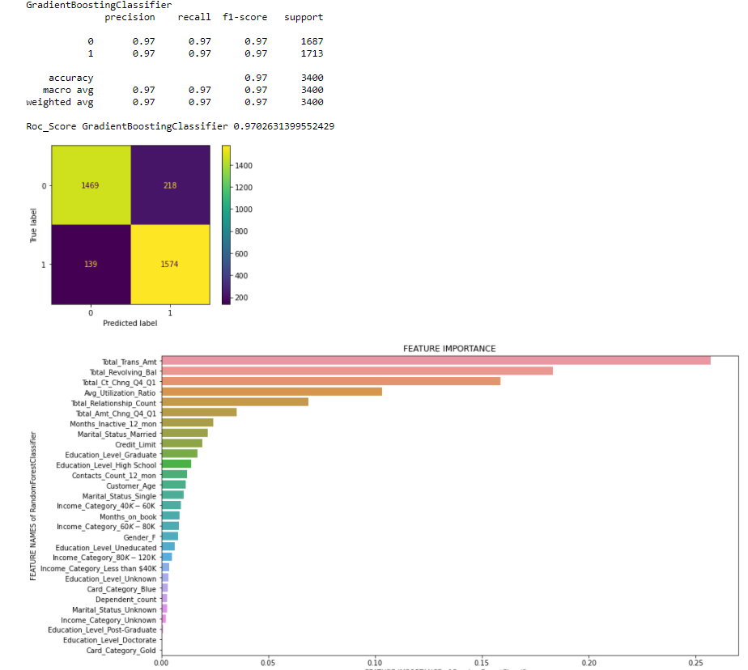

# Overview

In this project, together with the Streamlit library, I aimed to develop Classification models with the Credit Card Customers data I had accessed through Kaggle and to develop a Web Application with the most successful model. As a result of the study, I aimed to reach the most successful ROC and Recall values by changing the model parameters with the Web Application.

## Introduction

- The importance changes of the models and features to be used are shown below as an example.



## Web App Front Face

- The default values of model ROC and Recall results are shown in the first gif file.

- Affect the model results by changing the model parameters as in the second gif file.

- Newly obtained ROC and Recall values !


You can download requirements via pip install -r requirements.txt

```bash
pip3 install -r requirements.txt
```

Also you can visit my [Linkedin](https://www.linkedin.com/in/taylan-polat/) or [Github Page](https://github.com/taylan95?tab=repositories)